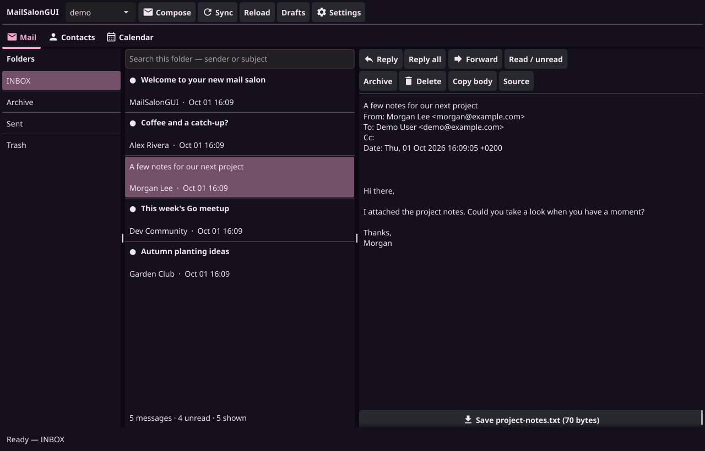

# MailSalonGUI

A standalone desktop version of MailSalon, written in **Go and Fyne**.
Version **0.1.4**. Its codebase, executable and configuration path are independent
of the terminal client. It reads the same local Maildirs and contact/calendar
files and supports MailSalon's TOML account settings.



## Build and try it

Install Go 1.24 or newer and the desktop dependencies described by
[Fyne's quick start](https://docs.fyne.io/started/quick/).
Fyne's desktop graphics driver needs cgo and a C compiler.

On CachyOS / Arch:

```sh
sudo pacman -S --needed go base-devel pkgconf libglvnd libxcursor libxrandr libxinerama libxi libxkbcommon wayland
```

On Debian / Ubuntu:

```sh
sudo apt install build-essential pkg-config libgl1-mesa-dev xorg-dev libxkbcommon-dev libwayland-dev
```

From the extracted `MailSalonGUI` directory:

```sh
make build
./MailSalonGUI -demo
```

The build script automatically prefers `zgo` when it is installed. To require
it explicitly, use `make build ZGO=zgo`. It otherwise uses Go and your configured
C compiler. The `Makefile` invokes the script with `sh`, so an archive that loses
executable permissions does not break the build.

Without Make:

```sh
zgo build -buildvcs=false -o MailSalonGUI ./cmd/MailSalonGUI
# Or with your normal cgo compiler:
go build -buildvcs=false -o MailSalonGUI ./cmd/MailSalonGUI
```

`-demo` creates an offline temporary Maildir, two contacts and one event. It
never reads your real mailbox and has no send or receive commands. Demo drafts,
settings and messages are removed on normal exit. Saved attachments go to the
location you choose in the file dialog.

## Connect your mail

Reuse an existing MailSalon configuration directly:

```sh
./MailSalonGUI -config=~/.config/mailsalon/config.toml
```

Or create a separate GUI configuration:

```sh
./MailSalonGUI -init-config
./MailSalonGUI
```

Open **Settings**, replace the example identity and sync account, then restart
the app. The settings editor validates TOML before replacing the file.
`-init-config` refuses to overwrite an existing file.

The default path comes from Go's `os.UserConfigDir()`:

| Platform | Default configuration |
| --- | --- |
| Linux | `$XDG_CONFIG_HOME/mailsalongui/config.toml`, normally `~/.config/mailsalongui/config.toml` |
| Windows | `%AppData%\mailsalongui\config.toml` |
| macOS | `~/Library/Application Support/mailsalongui/config.toml` |

Transport commands run through `/bin/sh -c` on Unix and `cmd.exe /C` on Windows.
Use commands appropriate to the machine. The current release was built and
checked on Linux; Windows/macOS native builds have not been validated.

See [Configuration](docs/configuration.md) for accounts, collections and themes,
and [Usage](docs/usage.md) for everyday workflows.

## Features

- Resizable folder, message and preview panes; multiple account selector.
- Local Maildir and Maildir++ discovery, including container-style INBOX layouts.
- Plain text messages; HTML-only mail converted to text without fetching remote images.
- Sender/subject search, read/unread state, archive and two-stage Trash deletion.
- Delete-key handling in the message list and right-click message actions.
- Separate compose windows with From, To, Cc, Bcc, signatures and attachments.
- Reply, reply all, Reply-To handling, threading headers and forward attachments.
- Automatic reply identity selection and a contact picker for recipient fields.
- Private local drafts that can be saved, reopened or deleted.
- Manual sync and a configurable periodic timer; duplicate receive commands run once per sync.
- Contacts and calendars: browse, search, create, edit original source and delete.
- CardDAV/CalDAV local vCard/iCalendar and JMAP JSContact/JSCalendar files.
- Optional GnuPG PGP/MIME signing, encryption, decryption and verification status.
- TOML settings editor and configurable colors.

Receiving and sending are handled by **MailSalonSync**, `mbsync`, `msmtp`, or your
chosen external command. MailSalonGUI itself does not log into IMAP, JMAP,
CardDAV or CalDAV servers. Your sync tool handles remote changes and credentials.

This first GUI release has a calendar item list, rather than a month/week grid.
It preserves recurrence in source but does not expand recurrences, manage RSVPs
or show reminders. Contact/event editing uses the native source so fields not
shown in the simple creation form are retained. Mail search currently matches
sender and subject; contact suggestions use the picker rather than inline
completion. Terminal `[keybindings]` settings are accepted for config
compatibility; GUI shortcuts are fixed as documented.

## Checks

```sh
make test
make check
# Optional real GnuPG integration test, on a host that supports gpg-agent sockets:
MAILSALONGUI_TEST_GPG=1 go test ./internal/pgp
```

The normal tests use Fyne's software driver (`-tags ci`), so no display is needed.
They cover Maildir mutations, MIME and attachments, recipient handling, configs,
drafts, empty GUI views, stale worker results and collection formats.
The real GnuPG round trip is opt-in because some sandboxed environments forbid
its agent sockets. No live mail accounts are contacted by the tests.

## Codebase

```text
cmd/MailSalonGUI/    Entry point and flags
internal/gui/       Fyne windows, mail view, compose, collections and settings
internal/config/    TOML loading, validation and embedded example
internal/maildir/   Local folder discovery, headers and Maildir operations
internal/mimeutil/  MIME parsing, HTML text conversion and message construction
internal/transport/ External sync/send commands
internal/pim/       Contact/calendar parsing and guarded local editing
internal/pgp/       Optional external GnuPG integration
internal/drafts/    Private local composition files
internal/demo/      Disposable demonstration data
```

See [Development](docs/development.md) and [Validation](docs/validation.md) for
worker ownership and the exact checks and limits of this release.

Backend code was adapted into this project from MailSalon; it is not a runtime
or module dependency. See [NOTICE](NOTICE) for the exact source commit.
License: [GNU GPL version 3](LICENSE).
